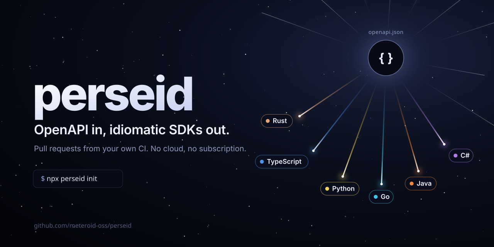

<p align="center"></p>

# perseid

Change your OpenAPI spec, and idiomatic Rust, TypeScript, Python, Go, Java and C# SDKs regenerate
and land as pull requests, in one repository or one per language.

One static binary, running in your CI: an open-source and headless alternative to Fern, Speakeasy and Stainless.

## Get started

In the repository that holds your spec, or in the one that will hold your SDKs and receive the spec:

```sh
npx perseid init    # writes perseid.toml: where the spec comes from, where the SDKs live
npx perseid setup   # plans, then sets up GitHub: repositories, keys, workflows, pull requests to merge
```

Merge the pull requests, and every spec change (or every release of your API) lands as SDK pull
requests, then releases. See [repository layouts](docs/ci.md#repository-layouts) to pick one.

Just trying it? `npx perseid init && npx perseid generate` writes the SDKs locally. Also installable
with `curl -fsSL https://sh.meteroid.com/perseid | sh` or as the `ghcr.io/meteroid-oss/perseid`
image; Linux and macOS, x64 and arm64.

What your users get:

```ts
const petstore = new Petstore("sk_live_...");
const pets = await petstore.pets.list({ limit: 10, status: "available" });
```

```python
petstore = Petstore("sk_live_...")
pets = petstore.pets.list(limit=10, status=PetStatus.AVAILABLE)
```

```csharp
using var petstore = new PetstoreClient("sk_live_...");
var pets = await petstore.Pets.ListAsync(new() { Limit = 10, Status = PetStatus.Available });
```

It powers the [Meteroid SDKs](https://github.com/meteroid-oss/meteroid-clients), and started as a fork of
[Svix's openapi-codegen](https://github.com/svix/openapi-codegen).

## What you get

- **SDKs that read like handwritten code.** Typed models, tolerant enums and unions, resource
  namespaces with `list`/`create`/`retrieve` methods, typed errors by status, retries with
  `Retry-After`, per-call options, sync and async where the language has them.
- **Auth, pagination and streaming.** Bearer, basic, API keys and OAuth2 tokens, iterators over
  paginated lists, server-sent events and file uploads.
- **Your code stays yours.** Perseid only rewrites or deletes files it marked `@generated`.
  Middleware, resource snippets and ejectable templates cover the rest, no fork needed.
- **Webhooks.** An opt-in [Standard Webhooks](https://www.standardwebhooks.com) verifier in every language.
- **CI-native.** `generate --check` fails on drift, `generate --pr` opens pull requests in this
  repository or in dedicated SDK repositories, and every SDK is versioned and published on its own.

## In your CI

`perseid setup` writes the workflow for you: it runs the `meteroid-oss/perseid@v0` Action
on every spec change (or on each release of your API), and `perseid status` tells how it fares. To set it up by hand, or on self-hosted runners and other CIs with the
`ghcr.io/meteroid-oss/perseid` image, see [CI and releases](docs/ci.md).

## Docs

- [Configuration](docs/configuration.md): `perseid.toml`, per-language options, editor completion
- [Customizing](docs/customizing.md): handwritten code, middleware, snippets, templates, webhooks
- [Auth, pagination, streaming and encoding](docs/features.md)
- [Languages](docs/languages.md): what each SDK looks like
- [CI and releases](docs/ci.md): the Action, Docker image, release automation, formatting

## Status

OpenAPI 3.0 and 3.1, JSON or YAML; Swagger 2.0 must be converted first (`npx swagger2openapi`)

Used on [Meteroid's API](https://github.com/meteroid-oss/meteroid-clients);

SDKs from the Stripe, GitHub, OpenAI, Twilio, DigitalOcean and Linode specs compile in every language, with one operation left out on Stripe and OpenAI.

Unsupported constructs fail generation loudly, naming the operation or schema: `exclude = ["<operation id>"]` skips one, and an issue with
the spec attached is the fastest way to get it supported.

## License

Apache-2.0. Includes MIT-licensed code from Svix and Meteroid, see [NOTICE](NOTICE).
