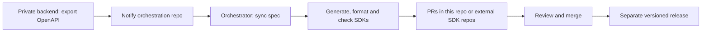

# Automatically generate SDKs from a private backend

The **orchestration repository owns SDK automation**. Your backend exports
OpenAPI and notifies it; the orchestrator synchronizes the spec, generates and
checks SDKs, and opens update PRs. SDKs can live in the orchestration repo or in
separate repositories. The backend needs no Perseid, formatters or SDK toolchains.

Start with two repositories: your existing private backend and a clients repo
that contains `perseid.toml` and the SDKs. A third, dedicated controller repo is
optional when you want to separate the SDK destinations later.



The primary example uses **an OpenAPI JSON file committed in the private backend**.
The notification triggers a workflow in the orchestration repo; `perseid sync`
fetches the spec through authenticated Git and commits its snapshot as part of
the SDK update PR. The backend source stays private. The orchestration/SDK repo
contains the exported API contract, so choose its visibility accordingly.
For specs produced only in CI, see [CI-only exports](#ci-only-exports).

## 1. Bootstrap the orchestration/clients repository

Create and clone a repository such as `acme/clients`, with `main` as its default
branch. Install Rust/rustup, Node/npm, Git and the GitHub CLI on your machine.
Download [`setup-sdk-tools.sh`](../examples/private-backend/setup-sdk-tools.sh),
save it outside the repo temporarily, and run it with Bash. It builds a pinned
Perseid revision and installs the same Rust/TypeScript formatters as Docker.
Add the two printed directories to your local `PATH`; CI uses `GITHUB_PATH`.

Authenticate GitHub with access to the backend and clients repositories:

```sh
gh auth login
gh auth setup-git
```

In your clients checkout, bootstrap Rust and TypeScript:

```sh
perseid init --name acme --language rust --language typescript
```

Init creates package manifests, generic error adapters, entry points, checks,
`.gitignore`, and `.perseid/overrides.toml`. It refuses file conflicts before
writing. For an existing SDK, retain its package/support files and write
`perseid.toml` directly using the [configuration reference](orchestration.md).

Replace the entire generated `[source]` table (remove `file = "openapi.json"`)
and add your API URL:

```toml
[source]
git = "acme/backend"
ref = "main"
path = "apis/generated/openapi.json"

[sdk]
default_base_url = "https://api.acme.example"
```

Keep the generated `[targets.rust]` and `[targets.typescript]` tables. The backend
must contain the exported JSON at that path. Its existing CI should check that
the committed export matches the API code. No sibling backend checkout is needed
for Perseid: Git supplies the file and the lock records the resolved commit.

Generate and validate the initial snapshot:

```sh
perseid sync
perseid generate --check
perseid check
```

The starter checks create Cargo/npm lockfiles as needed. Commit `perseid.toml`,
`perseid.lock.json`, `spec/openapi.json`, `.perseid/`, SDK sources, package manifests
and lockfiles. Push to the clients repo's main branch before enabling automation.
Keep `.perseid-work/` and dependency/build caches ignored. The package names from
init are starting values; choose the final names before publishing.

Destination-owned customization stays in `.perseid/overrides.toml`. For example,
after the initial Cargo lockfile exists:

```toml
[targets.rust]
template_overrides = ".perseid/templates"
check_commands = ["cargo test --locked"]
```

Mirror only the templates you customize, such as
`.perseid/templates/rust/api_resource.rs.jinja`. Other templates use embedded
defaults. Keep the init-generated TypeScript checks: they install dependencies
inside staging before building. See [extension points](orchestration.md#bootstrapping-and-destination-overrides)
for runtime overlays and custom settings.

## 2. Configure GitHub access

Register a GitHub App with repository **Contents: read/write** and
**Pull requests: read/write**. Install it on the private backend, the orchestration
repo, and any external SDK destinations. The example assumes one repository owner.
The orchestrator needs to read the private source and write SDK branches/PRs;
the backend notifier requests a token scoped only to the orchestration repo.
The built-in `GITHUB_TOKEN` cannot read another private repository.
[GitHub App authentication](https://docs.github.com/en/apps/creating-github-apps/authenticating-with-a-github-app/making-authenticated-api-requests-with-a-github-app-in-a-github-actions-workflow).

Configure these Actions variables/secrets:

| Repository | Setting | Kind | Example/value |
| --- | --- | --- | --- |
| Backend and orchestrator | `PERSEID_APP_CLIENT_ID` | Variable | App client ID |
| Backend and orchestrator | `PERSEID_APP_PRIVATE_KEY` | Secret | App PEM private key |
| Backend | `ORCHESTRATOR_REPOSITORY_NAME` | Variable | `clients` |
| Orchestrator | `PERSEID_REPOSITORIES` | Variable | Newline-separated `backend`, `clients`, plus external SDK repo names |

An organization-level secret/variable scoped to these repositories avoids copying
credentials manually. App-created PRs can trigger normal SDK checks; the built-in
token has special workflow-triggering rules. See GitHub's
[trigger behavior](https://docs.github.com/en/actions/how-tos/write-workflows/choose-when-workflows-run/trigger-a-workflow).

## 3. Install the workflows in their respective repositories

In the **orchestration/clients repo**, copy and commit:

| Example | Destination |
| --- | --- |
| [`setup-sdk-tools.sh`](../examples/private-backend/setup-sdk-tools.sh) | `.perseid/setup-ci.sh` |
| [`update-sdks.yml`](../examples/private-backend/update-sdks.yml) | `.github/workflows/update-sdks.yml` |
| [`check-sdks.yml`](../examples/private-backend/check-sdks.yml) | `.github/workflows/check-sdks.yml` |

In the **private backend**, copy
[`notify-openapi.yml`](../examples/private-backend/notify-openapi.yml) to
`.github/workflows/notify-openapi.yml`. Change its spec path to your exported
file. It sends a `repository_dispatch` notification when that committed spec
changes on main, and supports a manual trigger. To notify only after your existing
spec-validation job passes, move its notification steps after that job instead
of running a separate notifier workflow. There are no SDK commands in the backend.

Change branch names if you do not use `main`. The receiver workflow must be
committed on the orchestration repo's default branch for dispatch events to run.
GitHub documents the [repository_dispatch event](https://docs.github.com/en/actions/reference/workflows-and-actions/events-that-trigger-workflows#repository_dispatch).

The orchestrator always syncs the configured source ref (here, latest `main`),
then runs `perseid generate --pr`. Delayed notifications therefore refresh the
latest API instead of replaying an old spec. Generation, formatting and SDK checks
must all pass before PR delivery. Inputs and generator provenance are recorded;
identical locked inputs reuse the update PR. A new backend source commit can
produce a provenance-only lock change even if the spec bytes are identical.

The PR-check workflow uses `perseid check` against the committed snapshot; it
never fetches the private backend or calls `sync`. With SDKs in this repo, it
needs only read access to its own checkout. Keep full Git history/tags when using
Go version discovery. The helper script pins the generator and formatters for
both workflows. Upgrades should change that pin and the `perseid_version` setting
when the package version changes, run `sync` and regenerate, and commit the new
lock/outputs together.

Trigger the backend notifier manually once. Expect an SDK update PR in the
orchestrator repo containing the spec snapshot, lock/receipt changes and generated
code. Review and merge it. Later API changes follow the same path automatically;
manual SDK changes and local overrides stay in the SDK repository.

These examples install Rust and TypeScript tools. Add the other language tools
from the [tool table](orchestration.md#github-actions-and-docker) as needed. Docker
bundles all five formatters; compilation/tests still require the SDK toolchains.

## 4. Prepare versions and publish separately

Automatic regeneration and PR delivery are implemented. **Automatic
compatibility-based version selection is not implemented yet.** The update
workflow does not bump or publish packages on each backend commit.

When preparing a release, work in the orchestration repo using its synchronized
snapshot and choose affected targets:

```sh
printf '%s\n' 'Add widget filtering.' > changes.md
perseid version minor --target rust --notes changes.md
perseid version minor --target typescript --notes changes.md
perseid generate --pr
```

Review and merge the request/proposal/package versions. Independent SDK versions
come from the destination manifests or Go release tags, so a manual SDK release
requires no duplicate controller version edit. API `info.version` is separate.
Use `patch`, `minor`, `major`, or an explicit greater stable version; choose your
pre-1.0 breaking-change policy explicitly.

To publish through Perseid, configure registry-specific hooks in `perseid.toml`,
then sync/regenerate so the changed policy is part of the reviewed lock:

```toml
[targets.rust.release]
publish = "cargo publish --locked"
is_published = "./scripts/is-published.sh"

[targets.typescript.release]
publish = "npm publish"
is_published = "./scripts/is-published.sh"
```

Supply those probe scripts in the respective SDK directories. They receive
`PERSEID_VERSION`: return 0 when that exact package/version exists, 1 when absent,
and 2+ on authentication/network failures. Configure registry credentials in the
release environment. From a clean checkout of the merged release inputs:

```sh
perseid release --dry-run
perseid release
```

Dry-run checks without publishing. Actual publication uses immutable tags and
probes so interrupted releases can resume. Put these commands in an orchestration
workflow when ready, initially manual and later triggered by reviewed release
metadata. Merge all required SDK PRs first when destinations are separate repos.
See the [release reference](orchestration.md#versioning-and-releases).

## Where oasdiff fits

The local [oasdiff CLI](https://github.com/oasdiff/oasdiff) is a good API-contract
diff engine. In the **orchestration workflow**, preserve the previous snapshot
before sync if you want to attach a change report:

```sh
cp spec/openapi.json /tmp/previous-openapi.json
perseid sync
oasdiff changelog --format markdown /tmp/previous-openapi.json spec/openapi.json > changes.md
oasdiff breaking --fail-on WARN /tmp/previous-openapi.json spec/openapi.json
```

Pin oasdiff in CI. These commands need no hosted service. The optional
`breaking --fail-on WARN` gate stops on reported breaking changes; it does not
select a package version. Do not turn every nonzero exit into a major bump:
invalid specs and tool failures must also stop the workflow. See the
[oasdiff reference](https://github.com/oasdiff/oasdiff/blob/main/docs/BREAKING-CHANGES.md).

The next layer should **write the selected bump into the SDK PR automatically**,
with an editable proposal: unchanged SDK → no release; compatible addition →
minor; compatible fix → patch; breaking SDK change → major or the configured
pre-1.0 rule. That is stronger than merely printing a recommendation, while
leaving review/merge/publication separate.

Reliable selection requires each SDK's **last released baseline**, generated API
compatibility, and generator/runtime changes—not only the previous backend commit.
An enum/type change can affect languages differently; a runtime fix can warrant
a patch without an OpenAPI change. oasdiff alone cannot certify every generated
SDK's source compatibility. Today, choose the bump explicitly; automatic
classification and language-specific compatibility checks are future work.

## CI-only exports

If OpenAPI is not committed in the backend, keep the same ownership split:

1. The backend runs its exporter, uploads the JSON as an Actions artifact, then
   sends `openapi-updated` with the successful export run ID in `client_payload`.
2. The orchestration workflow downloads that artifact from the **configured
   backend repository**, using an App token with Actions read access there.
3. It places the file at `.perseid/incoming/openapi.json`, calls `perseid sync`,
   then follows the same generation/check/PR flow.

For that mode, replace the Git source with:

```toml
[source]
file = ".perseid/incoming/openapi.json"
```

Ignore `.perseid/incoming/`; the committed, locked snapshot remains
`spec/openapi.json`. The API spec is pulled into the orchestrator before generation,
not generated by the SDK workflow. The private backend still needs no SDK tools.

This requires adding the artifact upload/download steps to the examples: they
currently implement the committed-Git path. Validate the run's repository,
export workflow, branch and commit before consuming it; an old notification should
not overwrite a newer spec. Download a known artifact name, using GitHub's
[artifact download action](https://github.com/actions/download-artifact#download-artifacts-from-other-workflow-runs-or-repositories)
or `gh run download`. Do not take an arbitrary repository or command from a dispatch
payload. The notification does not transport the spec itself.

## Move SDKs into separate repositories

The orchestration workflow stays exactly where it is. Bootstrap each destination
with `perseid init --sdk-only`, commit its scaffolding and `.perseid/overrides.toml`,
then update target locations in the controller:

```toml
[targets.rust]
repository = "acme/rust-sdk"
directory = "."
```

Use `--directory .` when bootstrapping a root SDK and keep override keys aligned
with controller target names. Install the App on every destination and add them
to `PERSEID_REPOSITORIES`. The updater opens one PR per destination plus a controller
metadata PR; merge those before releasing. No new hosted service is required.

The included `check-sdks.yml` assumes SDKs are local. With private external
destinations, its controller check also needs credentials to clone them, or run
SDK-native build/test workflows in each destination. Do not copy a controller
`perseid check` command into an SDK-only repo that has no `perseid.toml`.
